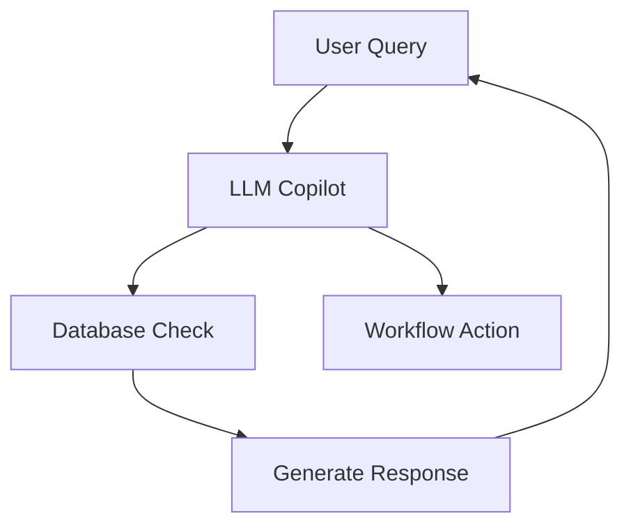

## Overview

Hello provides powerful automation tools designed for EdTech platforms and booking systems. You gain automated onboarding, progress tracking, admin workflow reductions, retention mechanisms, and custom LLM integrations. These features help scale operations while minimizing manual effort.

<Callout kind="info">
Focus on high-ROI automations first: onboarding and retention deliver the quickest wins.
</Callout>

<Columns cols={2}>
  <Card title="EdTech Automation" icon="book-open" href="#edtech">
    Automate student journeys from signup to completion.
  </Card>
  <Card title="Booking Systems" icon="calendar" href="#booking">
    Streamline appointments with reminders and triage.
  </Card>
</Columns>

## Automated Onboarding and Progress Tracking

Set up seamless user onboarding that handles payments and tracks progress automatically. Hello integrates with your payment gateway and sends personalized updates.

### Quick Setup

<Steps>
  <Step title="Connect Payment Gateway" icon="credit-card">
    Add your provider details in the dashboard.

````javascript
// Example API call to link Stripe
const response = await fetch('https://api.example.com/v1/gateways', {
  method: 'POST',
  headers: { 'Authorization': `Bearer ${YOUR_API_KEY}` },
  body: JSON.stringify({
    provider: 'stripe',
    keys: { public: 'pk_test_...', secret: 'sk_test_...' }
  })
});
````

  </Step>
  <Step title="Define Progress Milestones" icon="check-circle">
    Configure triggers for emails and notifications.
  </Step>
</Steps>

Track completion rates via the dashboard at `https://dashboard.example.com/progress`.

## Admin Workflow Reduction Tools

Reduce admin time by automating repetitive tasks like intake forms and scheduling.

<Expandable title="Advanced Workflow Customization" default-open="false">
Use custom rules to route tasks based on user data.

```javascript
// Rule example for task routing
const rules = {
  priority: 'high',
  conditions: { courseLoad: { '>': 5 } },
  action: 'assignToLeadAdmin'
};
```
</Expandable>

| Feature | Benefit | Time Saved |
|---------|---------|------------|
| Auto-triage | Routes inquiries | 40% |
| Bulk updates | Syncs student data | 30% |
| Report generation | Scheduled exports | 25% |

## Retention and Referral Automation

Build loops that encourage repeat engagement and referrals. Send targeted campaigns based on user behavior.

<Tabs>
  <Tab title="EdTech" icon="graduation-cap">
    Automate retention emails after course milestones.

````javascript
// Trigger retention campaign
await fetch('https://api.example.com/v1/campaigns/retention', {
  method: 'POST',
  body: JSON.stringify({
    userId: 'user_123',
    type: 'milestone',
    template: 'course-complete'
  })
});
````
  </Tab>
  <Tab title="Booking" icon="calendar-check">
    Reactivate lapsed clients with follow-ups.

````javascript
// Referral incentive setup
await fetch('https://api.example.com/v1/referrals', {
  method: 'POST',
  body: JSON.stringify({
    userId: 'client_456',
    reward: { discount: 20 }
  })
});
````
  </Tab>
</Tabs>

<Callout kind="tip">
Test campaigns with a small cohort before full rollout.
</Callout>

## Custom LLM Integration for Operations

Integrate LLMs for intelligent automation in support, sales, and ops. Create copilots that handle queries and generate insights.



### Integration Steps

<CodeGroup tabs="Node.js,Python">
```javascript
// Node.js LLM setup
const openai = require('openai');
const client = new openai({ apiKey: 'YOUR_OPENAI_KEY' });

const response = await client.chat.completions.create({
  model: 'gpt-4o-mini',
  messages: [{ role: 'user', content: 'Analyze this booking data' }]
});
```

```python
# Python LLM integration
import openai

response = openai.chat.completions.create(
    model="gpt-4o-mini",
    messages=[{"role": "user", "content": "Optimize this workflow"}]
)
```
</CodeGroup>

Connect via `https://api.example.com/v1/llm` endpoint for managed integrations.

## Next Steps

<Columns cols={3}>
  <Card title="Quickstart" icon="rocket" href="/quickstart">
    Set up your first automation.
  </Card>
  <Card title="API Reference" icon="code" href="/authentication">
    Integrate programmatically.
  </Card>
  <Card title="Changelog" icon="git-branch" href="/changelog">
    Stay updated on new features.
  </Card>
</Columns>